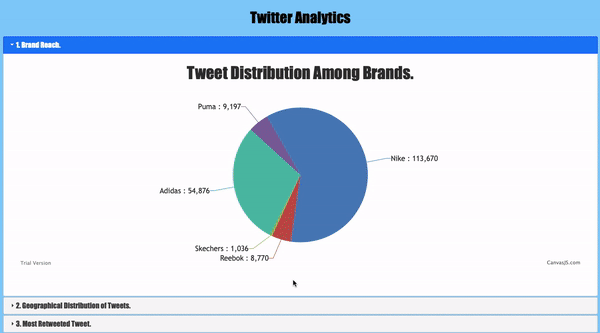

# TwitterAnalytics

Twitter is an online news and social networking site where people communicate in short messages called tweets and is one of the most popular social media platforms in the world.  The fast-paced nature of this platform means that it’s a great way for brands to start building a stronger online presence and learning how to track the right metrics could help any brand make insightful decisions about their future marketing campaign. 
Through this project, we decide to design, develop and execute a web application that would visualize interesting analytic Spark SQL queries executed on tweets for five famous brands namely Adidas, Nike, Puma, Skechers and Reebok.

## To build the code. <br>
```mvn clean package```

## To create the container. <br>

```docker build -t <build_name> .```

## To start the container process. <br>
	
```docker run -ti --rm --name server -p 9090:8080 <build_name>```

## To view the visualization. <br>

http://localhost:9090/BrandAnalyticsWebApp/


